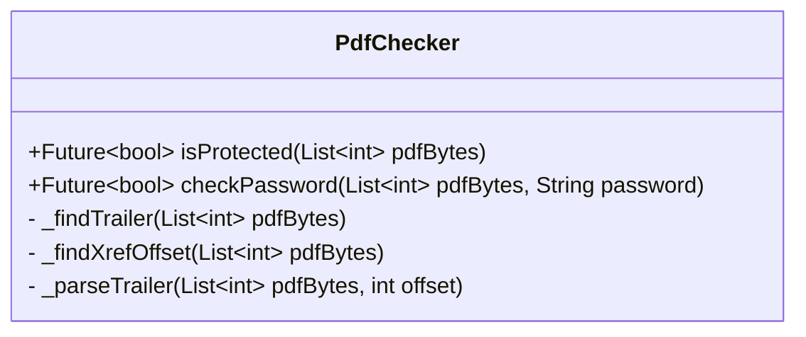

# DESIGN.md: PDF Checker Package

## 1. Overview

This document outlines the design for `pdf_checker`, a pure Dart package created to solve two primary problems for a banking requirement:
1.  Reliably determine if a PDF file is password-protected.
2.  Verify if a given password correctly unlocks a protected PDF file.

The package will be self-contained, with no dependencies on Flutter or any platform-specific plugins, ensuring it can be used in any Dart server-side or cross-platform environment. It will operate directly on the byte data of a PDF file.

## 2. Detailed Analysis

The core of the problem lies in understanding the PDF file structure as defined by the ISO 32000 standard. A PDF file is not a simple linear document; it is a complex graph of objects.

### Detecting Encryption

A PDF file is considered encrypted if its "trailer dictionary" contains an `/Encrypt` key. This key points to an "encryption dictionary," which holds all the information about the encryption method, permissions, and keys used to secure the document.

Therefore, to check if a file is protected, we must:
1.  Parse the raw PDF byte stream.
2.  Locate the file's trailer dictionary. This is typically at the end of the file.
3.  Read the trailer and check for the existence of the `/Encrypt` key.

### Verifying a Password

Password verification is more complex than simply detecting protection. It doesn't involve decrypting the entire file, but rather authenticating the user's password against security data stored in the encryption dictionary.

The process, according to the PDF specification, generally follows these steps:
1.  Retrieve the encryption dictionary.
2.  Extract key security values, most importantly:
    *   `/R`: The revision number of the security handler. This dictates which algorithm to use.
    *   `/O`: A 32-byte string derived from the **owner password**.
    *   `/U`: A 32-byte string derived from the **user password**.
    *   Other values like `/P` (permissions) and, for newer revisions, crypt filters.
3.  Using the provided user password, execute the specific validation algorithm corresponding to the `/R` value. This involves padding the password, hashing it (typically with MD5 or SHA-256), and using the result to generate a file-specific encryption key.
4.  Finally, this generated key is used to decrypt the `/U` value from the encryption dictionary. If the decrypted value matches a known padding string or another validation check passes, the password is correct.

This process must be implemented carefully and precisely according to the PDF standard to be reliable.

## 3. Alternatives Considered

### Alternative 2: Write a Custom PDF Parser from Scratch (Recommended)

-   **Description:** Implement a new PDF parser focused only on the parts of the specification needed to find the encryption dictionary.
-   **Pros:**
    -   No external dependencies.
    -   Full control over the implementation.
-   **Cons:**
    -   Extremely high complexity. The PDF specification is vast and has many edge cases.
    -   Very time-consuming and difficult to get right.
    -   High risk of introducing bugs that fail on certain types of PDF files.

**Decision:** Per the user's request, Alternative 2 will be implemented. The package will contain its own pure Dart logic to parse the PDF structure manually.

## 4. Detailed Design

The design is centered on a `PdfChecker` class with helper methods to manually parse the PDF file structure from its raw bytes. The primary goal is to locate the trailer dictionary without parsing the entire document.

### Class Diagram



### Public API

**`Future<bool> isProtected(List<int> pdfBytes)`**

-   **Purpose:** Checks if the provided PDF file bytes represent a password-protected file.
-   **Logic Flow:**
    1.  The method will call the internal `_findTrailer` helper.
    2.  `_findTrailer` will orchestrate the process of finding the cross-reference (`xref`) table offset and parsing the trailer dictionary.
    3.  If a trailer is successfully found, this method checks if it contains an `/Encrypt` key.
    4.  Returns `true` if the key exists, `false` otherwise. It will return `false` for malformed or unparsable PDFs.

**`Future<bool> checkPassword(List<int> pdfBytes, String password)`**
-   **(Note: This remains a future goal after basic parsing is implemented)**
-   **Purpose:** Verifies if the given `password` is the correct user password for the PDF.
-   **Logic Flow:**
    1.  First, it will locate the trailer and find the `/Encrypt` dictionary object.
    2.  It will then parse the encryption dictionary itself to extract security parameters (`/R`, `/U`, `/O`, etc.).
    3.  Based on the revision number (`/R`), it will select and implement the appropriate validation algorithm from the PDF specification.
    4.  It will execute the algorithm with the provided password and return `true` on success.

### Internal Parsing Logic

The core of the new design is a series of helper methods that navigate the PDF structure from the bottom up.

**`_findXrefOffset(List<int> pdfBytes)`**
1.  Reads a buffer of bytes from the *end* of the `pdfBytes` list (e.g., the last 1024 bytes).
2.  Converts the bytes to a string.
3.  Searches backwards from the end of the string for the `%%EOF` marker.
4.  From the position of `%%EOF`, it searches backwards for the `startxref` keyword.
5.  It then reads the integer value that follows the `startxref` keyword. This integer is the byte offset of the cross-reference section from the start of the file.

**`_findTrailer(List<int> pdfBytes)`**
1.  Calls `_findXrefOffset()` to get the starting position of the cross-reference section.
2.  Jumps to that offset in the `pdfBytes`.
3.  Determines if the section is a traditional cross-reference table (starts with `xref`) or a modern cross-reference stream (is a stream object). The initial design will focus on handling the traditional table.
4.  Parses the line(s) following the `xref` keyword to locate the `trailer` keyword.
5.  Parses the dictionary that follows the `trailer` keyword. This dictionary is the trailer dictionary. This will be a simple string-based parser looking for `<<` and `>>` and extracting key-value pairs.

**`_parseTrailer(...)`**
1.  This helper will handle the simple parsing of the dictionary string (e.g., `<< /Size 22 /Root 2 0 R /Info 1 0 R /Encrypt 21 0 R >>`).
2.  It will split the contents by `/` to identify keys and extract their corresponding values.
3.  It will return a `Map<String, dynamic>` representing the trailer.

### Flowchart of Logic

```mermaid
graph TD
    subgraph isProtected
        A[Start: isProtected(bytes)] --> B[_findXrefOffset];
        B -- offset --> C[_findTrailer];
        C -- trailerDict --> D{Has /Encrypt key?};
        D -- Yes --> E[Return true];
        D -- No/Error --> F[Return false];
    end

    subgraph _findXrefOffset
        G[Read end of file] --> H{Find '%%EOF'};
        H --> I{Find 'startxref'};
        I --> J[Read offset value];
        J --> K[Return offset];
    end
```

## 5. Summary of Design

The proposed design is to create a `PdfChecker` class with two public methods: `isProtected` and `checkPassword`. The implementation will **no longer use any third-party libraries** and will instead contain its own logic to manually parse a PDF file from the end to find the trailer dictionary. The primary `isProtected` function will be built first, with `checkPassword` being a more complex, subsequent goal. This approach provides full control and removes external dependencies at the cost of higher implementation complexity.

## 6. References

-   **PDF 1.7 Specification (Encryption):** [https://www.adobe.com/content/dam/acom/en/devnet/acrobat/pdfs/pdf_reference_1-7.pdf](https://www.adobe.com/content/dam/acom/en/devnet/acrobat/pdfs/pdf_reference_1-7.pdf) (Section 3.5)
-   **Overview of PDF Encryption:** [https://www.verypdf.com/document/pdf-format-reference/pg_0120.htm](https://www.verypdf.com/document/pdf-format-reference/pg_0120.htm)
